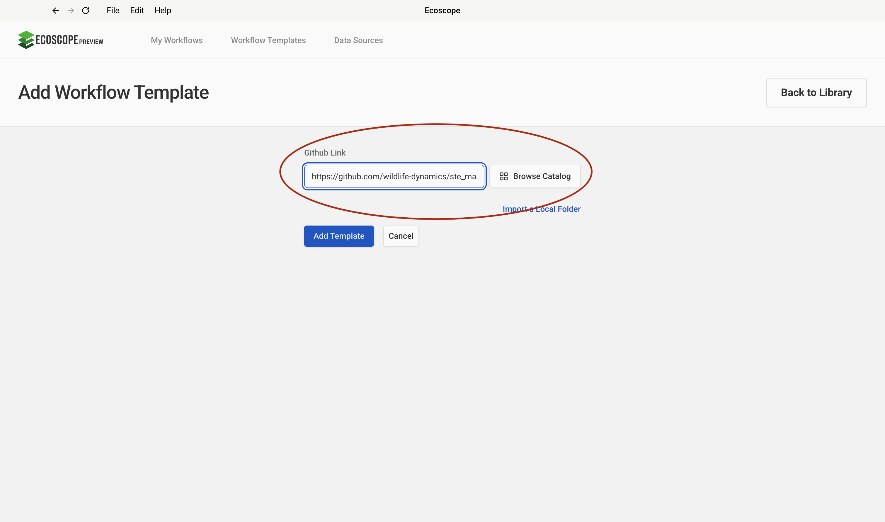
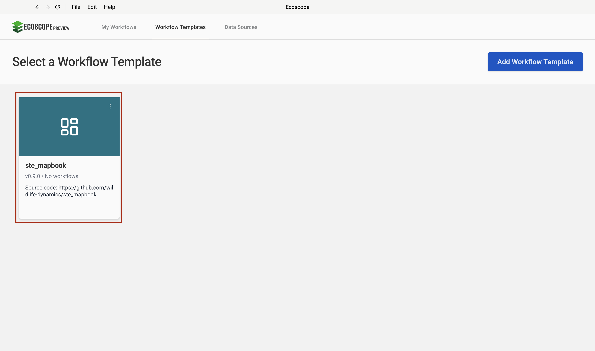
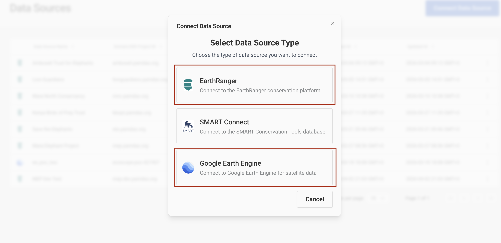
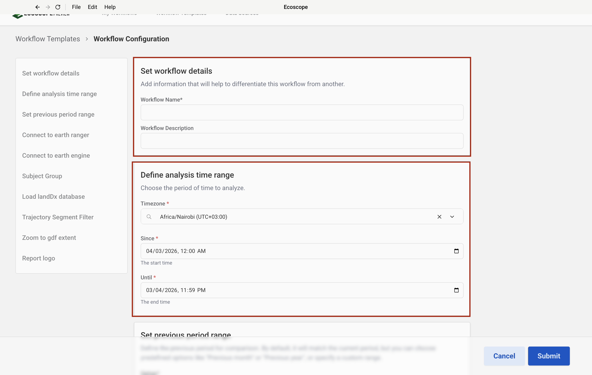
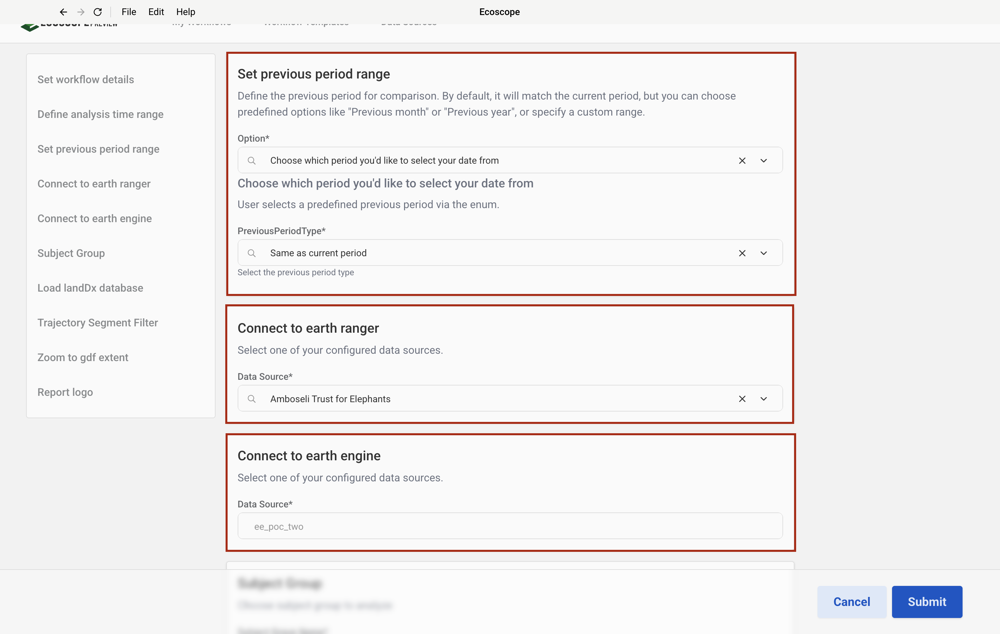
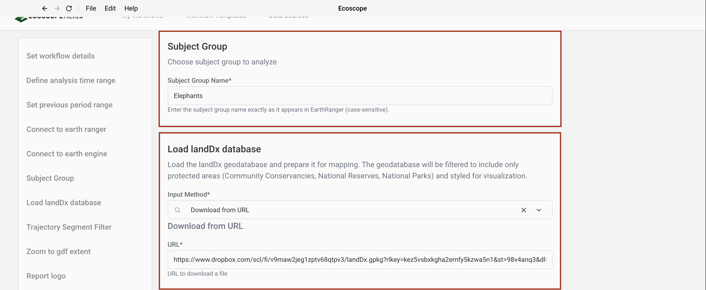
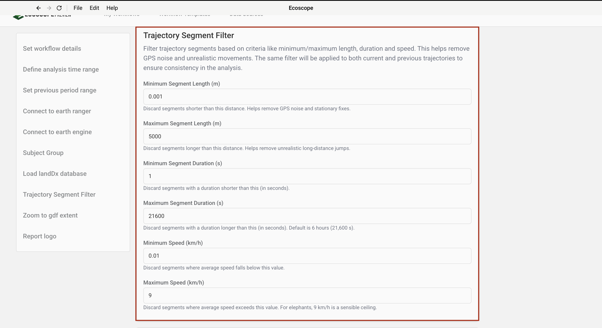
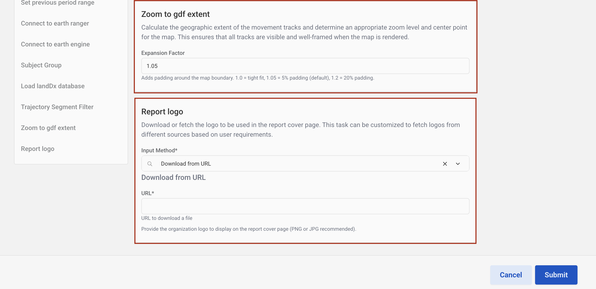

# STE Mapbook Workflow — User Guide

This guide walks you through configuring and running the STE Mapbook Workflow, which generates a multi-section mapbook report for wildlife tracking data sourced from EarthRanger and Google Earth Engine.

---

## Overview

The workflow produces, for each tracked subject:

- Six interactive map visualizations (movement tracks, speed, day/night, home range, mean speed raster, seasonal home range)
- A Word document mapbook (`.docx`) with a cover page and one section per subject
- An interactive widget dashboard

---

## Prerequisites

Before running the workflow, ensure you have:

- Access to an **EarthRanger** instance with a configured data source
- Access to a **Google Earth Engine** project
- The `landDx` geodatabase (downloaded automatically from Dropbox by default — no local copy required)

---

## Step-by-Step Configuration

### Step 1 — Add the Workflow Template

In the workflow runner, add a new template using the following GitHub repository URL:

```
https://github.com/wildlife-dynamics/ste_mapbook.git
```



---

### Step 2 — Select the Template

After adding the template, select it from the available templates list to load the STE Mapbook workflow.



---

### Step 3 — Configure Connections

Both an **EarthRanger** connection and a **Google Earth Engine** connection are required for the workflow to run. Configure these before proceeding to the workflow parameters.



#### Configure EarthRanger Connection

Enter your EarthRanger server URL and authentication credentials to establish the EarthRanger data connection.


#### Configure Google Earth Engine Connection

Enter your Google Earth Engine project name to establish the GEE connection used for seasonal analysis.


---

### Step 4 — Set the Workflow Time Range

Define the analysis period by setting the **Since** (start) and **Until** (end) dates. All movement data, trajectories, and home ranges will be computed within this window.



---

### Step 5 — Set the Previous Period and Connection

Select a **previous period** to use as a comparison baseline on the Movement Tracks map, and confirm the active data connections.

| Option | Description |
|--------|-------------|
| Same as current period | Mirrors the current period length, ending at the current start date |
| Previous month | Calendar month before the current period |
| Previous 3 months | Three calendar months before the current period |
| Previous 6 months | Six calendar months before the current period |
| Previous year | One calendar year before the current period |
| Enter start date | Manually specify a start date for the previous period |



---

### Step 6 — Select Subject Group and Load landDx Database

Enter the **Subject Group Name** exactly as it appears in EarthRanger (case-sensitive). The default value is `Elephants`.

For the **landDx geodatabase**, which contains protected area boundaries used as base layers on all maps:

- If you do not have the database stored locally, a **Dropbox download URL is provided by default** — no action is needed.
- If you have a local copy, you can supply the path to your `.gpkg` file instead.



---

### Step 7 — Configure Trajectory Segment Filter

These filters remove GPS noise and unrealistic movements before trajectory analysis. The same filter is applied to both the current and previous period trajectories.

| Field | Default | Description |
|-------|---------|-------------|
| Minimum Segment Length (m) | `0.001` | Discard segments shorter than this distance |
| Maximum Segment Length (m) | `5000` | Discard segments longer than this distance |
| Minimum Segment Duration (s) | `1` | Discard segments shorter than this duration |
| Maximum Segment Duration (s) | `21600` | Discard segments longer than this duration (6 hours) |
| Minimum Speed (km/h) | `0.01` | Discard segments below this average speed |
| Maximum Speed (km/h) | `9` | Discard segments above this average speed |

Adjust these values to suit the movement characteristics of your study species.



---

### Step 8 — Zoom to GDF Extent and Report Logo

**Zoom to GDF Extent**

Set the **Expansion Factor** to control the map padding around the data boundary. A value of `1.0` gives a tight fit; `1.05` (default) adds 5% padding; `1.2` adds 20% padding.

**Report Logo**

The logo appears on the mapbook cover page. You can either:

- Provide a **URL** to a PNG or JPG image to download it automatically.
- Provide a **local file path** to an image on your machine.



---

## Running the Workflow

Once all parameters are configured, submit the workflow. The runner will:

1. Pull movement data from EarthRanger for the specified subject group and time range.
2. Filter trajectories using the segment filter settings.
3. Compute home ranges, speed rasters, and seasonal ranges using Google Earth Engine.
4. Generate all map visualizations and the Word mapbook.
5. Save all outputs to the directory specified by `ECOSCOPE_WORKFLOWS_RESULTS`.

---

## Output Files

All outputs are written to `$ECOSCOPE_WORKFLOWS_RESULTS/`:

| File | Description |
|------|-------------|
| `trajectories.geoparquet` | Current period trajectories |
| `previous_period_trajectories.geoparquet` | Previous period trajectories |
| `relocations.geoparquet` | Current period relocations |
| `previous_period_relocations.geoparquet` | Previous period relocations |
| `*.geoparquet` (ETD, MCP, seasonal) | Home range polygons per subject |
| `*_movement_tracks.html` | Interactive movement tracks map per subject |
| `*_speedmap.html` | Interactive speed map per subject |
| `*_day_night.html` | Interactive day/night map per subject |
| `*_homerange.html` | Interactive home range map per subject |
| `*_mean_speed_raster.html` | Interactive mean speed raster per subject |
| `*_seasonal_home_range.html` | Interactive seasonal home range per subject |
| `mapbook_context_page.docx` | Cover page document |
| `*.docx` (per subject) | Individual subject report sections |
| Merged mapbook `.docx` | Final combined Word report |
