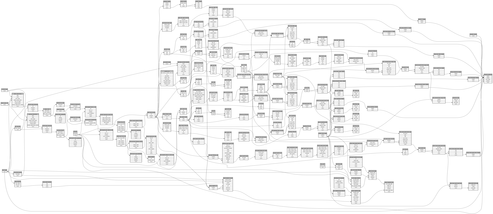

```
# AUTOGENERATED BY ECOSCOPE-WORKFLOWS; see fingerprint in README.md for details

```

```yaml
# fingerprint:
artifacts_sha256_basic: fb0e37e4fd0556ddfbec6059cc9efdb4fe80b3c43600e24dbe08dee442f1ed66
artifacts_sha256_strict: 5e4607e3b404507bf75de73e4c7930fa938800e1703e9307f4d2ddd0200de017
installed_requirements:
- channel: https://repo.prefix.dev/ecoscope-workflows/
  name: ecoscope-platform
  version: {version: ==2.15.1}
- channel: https://repo.prefix.dev/ecoscope-workflows-custom/
  name: ecoscope-workflows-ext-custom
  version: {version: ==0.1.0rc14}
- channel: https://repo.prefix.dev/ecoscope-workflows-custom/
  name: ecoscope-workflows-ext-ste
  version: {version: ==0.0.0rc1}
- channel: conda-forge
  name: pydeck
  version: {version: ==0.9.2}
- channel: conda-forge
  name: opentelemetry-sdk
  version: {version: ==1.43.0}
params_sha256: d8a8b68ff99c26a855eaa63b8e9c262cdcf0440f9e54db4ad86f0c93a32b1e15
spec_sha256: 7608d15b65d75f6d7d330c7103078157466550b8cf6db44b72d64373628af273

```

# ecoscope-workflows-mapbook-report-workflow


