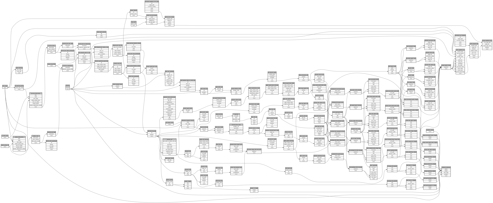

```
# AUTOGENERATED BY ECOSCOPE-WORKFLOWS; see fingerprint in README.md for details

```

```yaml
# fingerprint:
artifacts_sha256_basic: d31d1efa2d013a8c59cc4ac7622fa753c6d40c5c4b1a95fb093881a587a5a890
artifacts_sha256_strict: aa738456b9a36d3e00335f8c0c243484636a25549e9cb314a92788931c2e975f
installed_requirements:
- channel: https://repo.prefix.dev/ecoscope-workflows/
  name: ecoscope-workflows-core
  version: {version: ==0.22.17}
- channel: https://repo.prefix.dev/ecoscope-workflows/
  name: ecoscope-workflows-ext-ecoscope
  version: {version: ==0.22.17}
- channel: https://repo.prefix.dev/ecoscope-workflows-custom/
  name: ecoscope-workflows-ext-custom
  version: {version: ==0.0.39}
- channel: https://repo.prefix.dev/ecoscope-workflows-custom/
  name: ecoscope-workflows-ext-big-life
  version: {version: ==0.0.8}
- channel: https://repo.prefix.dev/ecoscope-workflows-custom/
  name: ecoscope-workflows-ext-ste
  version: {version: ==0.0.18}
params_sha256: 40bebd951b9756946ece371fd44f0898f3dcfce2c3a52ceda60932f8ba54d96e
spec_sha256: fec695863863440122218764a9fd9d1f501712962e82dd7dbb8c000bee0d8914

```

# ecoscope-workflows-ste-mapbook-workflow


