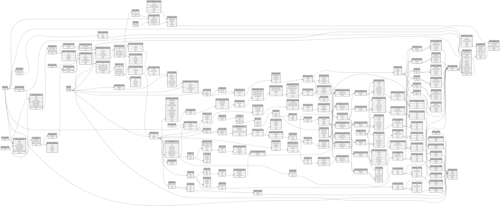

```
# AUTOGENERATED BY ECOSCOPE-WORKFLOWS; see fingerprint in README.md for details

```

```yaml
# fingerprint:
artifacts_sha256_basic: 9483c3dfb19e7f8005c28cf9164055f98c83e9b0c2494b992b25aac75008912c
artifacts_sha256_strict: 20fbf909547a564afbd31701e1b5f37d8601d08d027533b24de2819ff019abdb
installed_requirements:
- channel: https://repo.prefix.dev/ecoscope-workflows/
  name: ecoscope-workflows-core
  version: {version: ==0.22.17}
- channel: https://repo.prefix.dev/ecoscope-workflows/
  name: ecoscope-workflows-ext-ecoscope
  version: {version: ==0.22.17}
- channel: https://repo.prefix.dev/ecoscope-workflows-custom/
  name: ecoscope-workflows-ext-custom
  version: {version: ==0.0.56}
- channel: conda-forge
  name: pydeck
  version: {version: ==0.9.2}
- channel: https://repo.prefix.dev/ecoscope-workflows-custom/
  name: ecoscope-workflows-ext-big-life
  version: {version: ==0.0.8}
- channel: https://repo.prefix.dev/ecoscope-workflows-custom/
  name: ecoscope-workflows-ext-ste
  version: {version: ==0.0.22}
params_sha256: 1cf6836e21d73e4bdcfa8bb04cc76421eabc8fe27d411a618d49ed54ad0fdcaf
spec_sha256: e21c316a9af793be3bcd8e8e50ba61ece828819f5e170e9f9fc0bb0aeef5d1bf

```

# ecoscope-workflows-ste-mapbook-workflow


